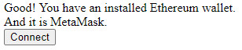
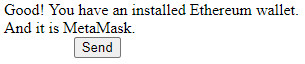

# Connection with *MetaMask* (ETH)

## Requirements
That the page is served.

When developing, a server should run, **it is not enough to load the HTML file in the browser.** For this, you can use `http-server`, which is installed as follows:

```console
$ npm install http-server -g
```

Then, you can open a terminal the folder where the file that you want to serve, and run

```console
$ http-server

Starting up http-server, serving ./

http-server version: 14.1.0

http-server settings: 
CORS: disabled
Cache: 3600 seconds
Connection Timeout: 120 seconds
Directory Listings: visible
AutoIndex: visible
Serve GZIP Files: false
Serve Brotli Files: false
Default File Extension: none

Available on:
  http://169.254.240.247:8080
  http://192.168.137.1:8080
  http://192.168.43.76:8080
  http://127.0.0.1:8080
Hit CTRL-C to stop the server
...
```

## Web3 Browser Detection
To verify if the browser is compatible with Ethereum, the following is used:
```js
if (typeof window.ethereum !== 'undefined') {
  // Then there is some installed wallet
}
```

## Detecting *MetaMask*
If you want to differentiate *MetaMask* from other Ethereum-compatible browsers, you can detect *MetaMask* using `ethereum.isMetaMask`.

## Connecting and Sending a Transaction

In the implemented prototype `eth-conn-and-send-prototype.html`, the *MetaMask* wallet is connected with the page and a 0.01 ETH transaction is performed to an address in the *Ropsten* test network (0x6CC5C2AB53F1876D6A2326665D).

For this, first it is verified that the browser has installed *MetaMask*, through the use of `window.ethereum` and` ethereum.isMetaMask`:
```js
if (typeof window.ethereum !== 'undefined') {
    msgDiv.textContent = 'Good! You have an installed Ethereum wallet.';

    if (ethereum.isMetaMask) {
        msgDiv.innerHTML += '<br /> And it is MetaMask.';
        connBtn.style.visibility = 'visible';
    }
} else {
    msgDiv.textContent = 'Sorry, no wallet installed :(';
}
```
If *MetaMask* is installed, the connection button is displayed:



When pressing the button, the `connect()` function is called. This

1. hides the Connect button, since an order will be asked to *MetaMask* and any successive order that is made in what is processed the first, will be rejected (see [Ethereum Provider API](https://docs.metamask.io/guide/ethereum-provider.html#using-the-provider));
2. places the order to *MetaMask*, using the method `eth_requestAccounts` (see [RPC API](https://docs.metamask.io/guide/rpc-api.html#eth-requestaccounts)) to connect the wallet with the site; and
3. in case an error occurs in the previous step, it notifies it via console and returns the visibility to the connect button;
4. if everything went well with step 2, then the send button is visible.
   
   

```js
function handleAccountsChanged(accounts) {
    if (accounts.length === 0) {
        // MetaMask is locked or the user has not connected any accounts
        console.log('Please connect to MetaMask.');
        connBtn.style.visibility = 'visible';

    } else if (accounts[0] !== currentAccount) {
        currentAccount = accounts[0];
        sendBtn.style.visibility = 'visible';
    }
}

function connect() {
    connBtn.style.visibility = 'hidden';

    ethereum
        .request({ method: 'eth_requestAccounts' })
        .then(handleAccountsChanged)
        .catch((err) => {
            if (err.code === 4001) {
                // EIP-1193 userRejectedRequest error
                // If this happens, the user rejected the connection request.
                console.log('Please connect to MetaMask.');
            } else {
                console.error(err);
            }
            connBtn.style.visibility = 'visible';
        });
}
```

If clicking on the send button, then the asynchronous `send()` function is executed, which sends an `eth_sendtransaction` order (see [Sending Transactions](https://docs.metamask.io/guide/sending-transactions.html#sending-transactions)):

```js
async function send() {
    const txHash = await ethereum.request({
        method: 'eth_sendTransaction',
        params: [{
            to: '0x6cC5C2AB53F1876F3E663e5A4B496D6a2326665D',
            from: ethereum.selectedAddress,
            value: '0x2386f26fc10000'
        }]
    });
}
```

The `value` field should contain a `string` with the hexadecimal value in *wei* of the amount to be transferred.

### Improvements
- That is verified when loading the page if you can already send directly. Assess the use of `ethereum.isConnected()` (see [Ethereum Provider API](https://docs.metamask.io/guide/ethereum-provider.html#ethereum-isconnected)).
- See that the network to which the *MetaMask* is connected is the one you want. There are events that are unleashed when changing network, account, etc.

<!-- ## User State
Currently there are a few stateful things to consider when interacting with this API:

- What is the current network?
- What is the current account?

Both of these are available synchronously as `ethereum.networkVersion` and `ethereum.selectedAddress`. You can listen for changes using events too, see (the API reference). -->

## References
[https://docs.metamask.io/guide/getting-started.html#basic-considerations](https://docs.metamask.io/guide/getting-started.html#basic-considerations)

[https://docs.metamask.io/guide/ethereum-provider.html#table-of-contents](https://docs.metamask.io/guide/ethereum-provider.html#table-of-contents)

[https://docs.metamask.io/guide/sending-transactions.html#sending-transactions](https://docs.metamask.io/guide/sending-transactions.html#sending-transactions)

[https://docs.metamask.io/guide/rpc-api.html#rpc-api](https://docs.metamask.io/guide/rpc-api.html#rpc-api)